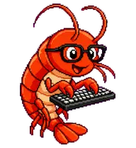

# Shrimpy Keys

Shrimpy Keys is a bright red pixel shrimp with black-rimmed glasses and a tiny keyboard. It is a Codex-compatible animated pet built for a cheerful coding companion vibe: tiny, focused, a little silly, and always typing.

## Preview



This package includes the complete pet atlas:

- `preview.png` - animated PNG preview generated from the actual pet spritesheet
- `preview.gif` - fallback animated GIF preview
- `spritesheet.webp` - Codex pet spritesheet
- `pet.json` - Codex pet manifest
- `install.sh` - installer for copying the pet into Codex's pet directory
- `sample-info.json` - publication and listing metadata

## Pet Details

- Pet ID: `shrimpy-keys`
- Display name: `Shrimpy Keys`
- Style: pixel-art mascot
- Theme: coding companion, shrimp, keyboard, glasses
- Sprite version: `2`
- Atlas size: `1536x2288`
- Cell size: `192x208`
- Layout: 8 columns x 11 rows

## Included Animations

Shrimpy Keys uses the Codex v2 pet format, including the standard animation rows plus look-direction support.

Standard rows:

- idle
- running-right
- running-left
- waving
- jumping
- failed
- waiting
- running
- review

Look rows:

- 16 gaze directions from `000` through `337.5`
- Four cardinal anchors: up, right, down, left
- Direction cues use Shrimpy's glasses, eyes, head tilt, antennae, and keyboard posture

## Install

From this package directory, run:

```sh
chmod +x ./install.sh
./install.sh
```

The installer copies the pet into:

```text
${CODEX_HOME:-~/.codex}/pets/shrimpy-keys
```

After installation, the Codex pet folder contains:

```text
pet.json
spritesheet.webp
preview.png
preview.gif
README.md
install.sh
sample-info.json
```

Codex reads `pet.json`, which points to `spritesheet.webp`.

## Manifest

```json
{
  "id": "shrimpy-keys",
  "displayName": "Shrimpy Keys",
  "description": "A bright red pixel shrimp with black-rimmed glasses typing on a tiny keyboard.",
  "spriteVersionNumber": 2,
  "spritesheetPath": "spritesheet.webp"
}
```

## Publication Blurb

Shrimpy Keys is a tiny red shrimp coder with chunky black glasses and a keyboard that is somehow exactly shrimp-sized. It idles, waves, waits for input, reviews work, handles failures with dignity, and now looks around in all 16 Codex v2 directions.

## Notes

- Keep `spriteVersionNumber: 2` in `pet.json`; the v2 atlas includes the extra look-direction rows.
- Do not resize or recompress `spritesheet.webp` unless you revalidate the atlas dimensions and transparency.
- The pet is designed around transparent-background sprites and should remain readable at small overlay sizes.
